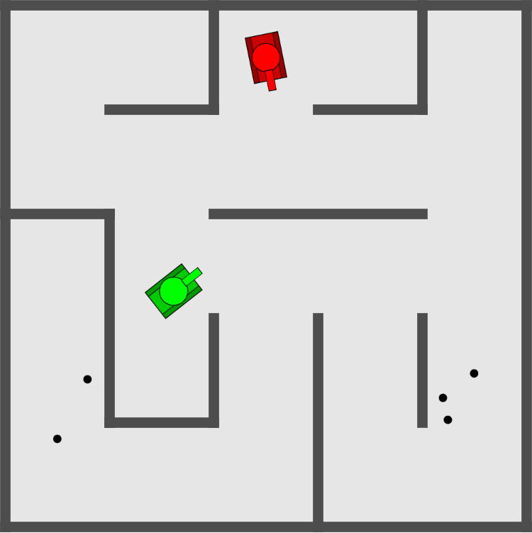
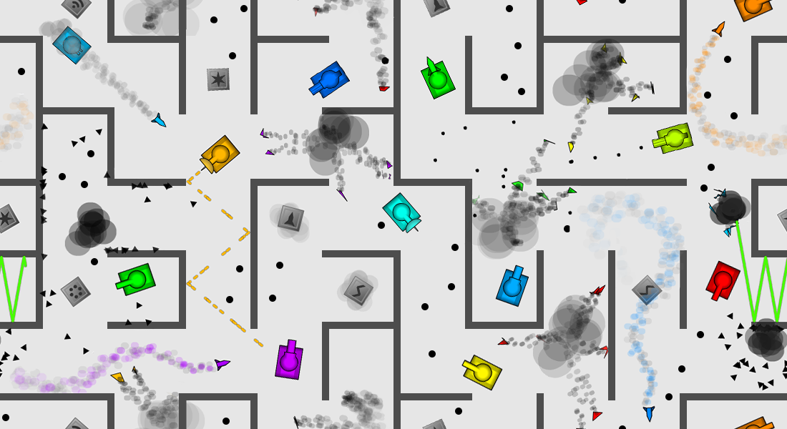

# simple-tank

[try it out!](http://47.93.5.8:8080)

Rewrite of TankTrouble2, a lovely flash game, gone along with flash.

- using [Deno](https://deno.land/) as web server, no other 3rd-party libs
- using [mini.css](https://minicss.org/)
- written in pure javascript
- physics engine from scratch

## References ##

- [TankTrouble2 swf from 7k7k.com](http://flash.7k7k.com/cms/cms10/20150714/1636512198/44/7.swf)
- TankTrouble2 theme

    
    
- [Collision Detection](https://www.jeffreythompson.org/collision-detection/) tutorial by Jeff Thompson

